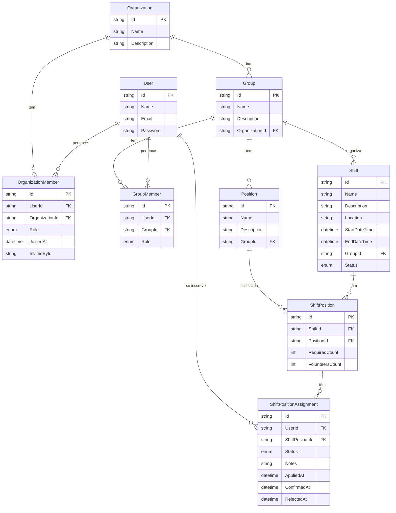

# Volts Backend

O Volts é um sistema de gerenciamento de voluntários para eventos e organizações. Ele permite que organizações criem grupos, escalas e posições, e que voluntários se inscrevam para trabalhar nessas posições.

O sistema é utilizado por:

- **Administradores de Organizações**: Criam e gerenciam organizações, grupos e escalas
- **Líderes de Grupos**: Gerenciam grupos específicos e seus membros
- **Voluntários**: Visualizam e se inscrevem em posições disponíveis nas escalas

As principais entidades do sistema se relacionam da seguinte forma:

- **Organizações (Organizations)**: Entidade principal que representa uma instituição ou evento
- **Grupos (Groups)**: Subdivisões dentro de uma organização, como departamentos ou equipes
- **Escalas (Shifts)**: Períodos de trabalho com data, hora e local definidos
- **Posições (Positions)**: Funções específicas que podem ser ocupadas por voluntários
- **Inscrições (ShiftPositionAssignments)**: Registros de voluntários inscritos para trabalhar em posições específicas

## Modelo de Domínio do Volts

O diagrama abaixo representa as principais entidades do sistema Volts e seus relacionamentos.



## Descrição dos Relacionamentos

1. **User - OrganizationMember**: Um usuário pode pertencer a várias organizações, e uma organização pode ter vários membros.

2. **Organization - Group**: Uma organização pode ter vários grupos, mas um grupo pertence a apenas uma organização.

3. **Organization - Position**: Uma organização pode definir várias posições, e cada posição pertence a uma organização.

4. **User - GroupMember**: Um usuário pode ser membro de vários grupos, e um grupo pode ter vários membros.

5. **Group - Shift**: Um grupo pode organizar várias escalas, e cada escala é organizada por um grupo.

6. **Shift - ShiftPosition**: Uma escala pode ter várias posições, e cada posição de escala está associada a uma escala.

7. **Position - ShiftPosition**: Uma posição pode ser usada em várias escalas, e cada posição de escala está associada a uma posição.

8. **ShiftPosition - ShiftPositionAssignment**: Uma posição de escala pode ter várias inscrições de voluntários, e cada inscrição está associada a uma posição de escala.

9. **User - ShiftPositionAssignment**: Um usuário pode se inscrever em várias posições de escala, e cada inscrição está associada a um usuário.

## Rotas da API

### Autenticação

- `POST /api/auth/register` - Registra um novo usuário
- `POST /api/auth/login` - Autentica um usuário e retorna um token JWT

### Usuários

- `GET /api/user` - Retorna todos os usuários
- `GET /api/user/{id}` - Retorna um usuário específico
- `GET /api/user/organizations` - Retorna todas as organizações e grupos do usuário autenticado
- `PUT /api/user/{id}` - Atualiza um usuário
- `DELETE /api/user/{id}` - Remove um usuário

### Organizações

- `GET /api/organization` - Retorna todas as organizações
- `GET /api/organization/{id}` - Retorna uma organização específica
- `POST /api/organization` - Cria uma nova organização
- `PUT /api/organization/{id}` - Atualiza uma organização
- `DELETE /api/organization/{id}` - Remove uma organização
- `POST /api/organization/{id}/member` - Adiciona um membro à organização
- `DELETE /api/organization/{id}/member/{userId}` - Remove um membro da organização

### Grupos

- `GET /api/group` - Retorna todos os grupos
- `GET /api/group/{id}` - Retorna um grupo específico
- `POST /api/group` - Cria um novo grupo
- `PUT /api/group/{id}` - Atualiza um grupo
- `DELETE /api/group/{id}` - Remove um grupo
- `POST /api/group/{id}/member` - Adiciona um membro ao grupo
- `DELETE /api/group/{id}/member/{userId}` - Remove um membro do grupo

### Posições

- `GET /api/position` - Retorna todas as posições
- `GET /api/position/{id}` - Retorna uma posição específica
- `POST /api/position` - Cria uma nova posição
- `PUT /api/position/{id}` - Atualiza uma posição
- `DELETE /api/position/{id}` - Remove uma posição

### Escalas

- `GET /api/shift` - Retorna todas as escalas
- `GET /api/shift/{id}` - Retorna uma escala específica
- `POST /api/shift` - Cria uma nova escala
- `PUT /api/shift/{id}` - Atualiza uma escala
- `DELETE /api/shift/{id}` - Remove uma escala
- `POST /api/shift/{id}/position` - Adiciona uma posição à escala
- `DELETE /api/shift/{id}/position/{positionId}` - Remove uma posição da escala

### Inscrições de Voluntários

- `GET /api/shiftpositionassignment/shift/{shiftId}` - Retorna todas as inscrições para uma escala
- `GET /api/shiftpositionassignment/position/{positionId}` - Retorna todas as inscrições para uma posição
- `GET /api/shiftpositionassignment/{id}` - Retorna uma inscrição específica
- `POST /api/shiftpositionassignment/apply/{shiftPositionId}` - Inscreve o usuário em uma posição
- `PUT /api/shiftpositionassignment/{id}/confirm` - Confirma uma inscrição
- `PUT /api/shiftpositionassignment/{id}/cancel` - Cancela uma inscrição
- `DELETE /api/shiftpositionassignment/{id}` - Remove uma inscrição

## Estrutura do Projeto

O projeto segue uma arquitetura em camadas:

- **Controllers (Volts.Api)**: Responsáveis por receber as requisições HTTP e retornar as respostas
- **Services (Volts.Application)**: Implementam a lógica de negócio e orquestram as operações
- **Repositories (Volts.Infrastructure)**: Responsáveis pelo acesso aos dados
- **Entities (Volts.Domain)**: Definem o modelo de domínio e as regras de negócio
- **DTOs (Volts.Application)**: Objetos de transferência de dados entre as camadas

## 🧰 Tecnologias Utilizadas

- **Linguagem principal:** C#
- **Framework:** .NET Core 8
- **Banco de dados:** PostgreSQL (com suporte futuro via Supabase)
- **ORM:** Entity Framework Core
- **Autenticação:** JWT (JSON Web Token)
- **Padrões de arquitetura:** Repository Pattern, Unit of Work, DTOs e Services
- **Outras:** Swagger

## Como Rodar o Projeto

### Pré-requisitos

- .NET 6 SDK ou superior
- Visual Studio 2022, VS Code ou Rider

### Passos para Execução

```bash
# 1. Clone o repositório:

git clone https://github.com/seu-usuario/volts-backend.git

cd volts-backend

# 2. Restaure os pacotes:

dotnet restore

# 3. Execute as migrações do banco de dados:

cd Volts.Api
dotnet ef database update

# 4. Execute o projeto:

dotnet run

# 5. Acesse a documentação da API:

https://localhost:5001/swagger
```

### Configuração do Ambiente

Para configurar variáveis de ambiente ou outras configurações, edite o arquivo `appsettings.json` ou crie um arquivo `appsettings.Development.json` para configurações específicas de desenvolvimento.
