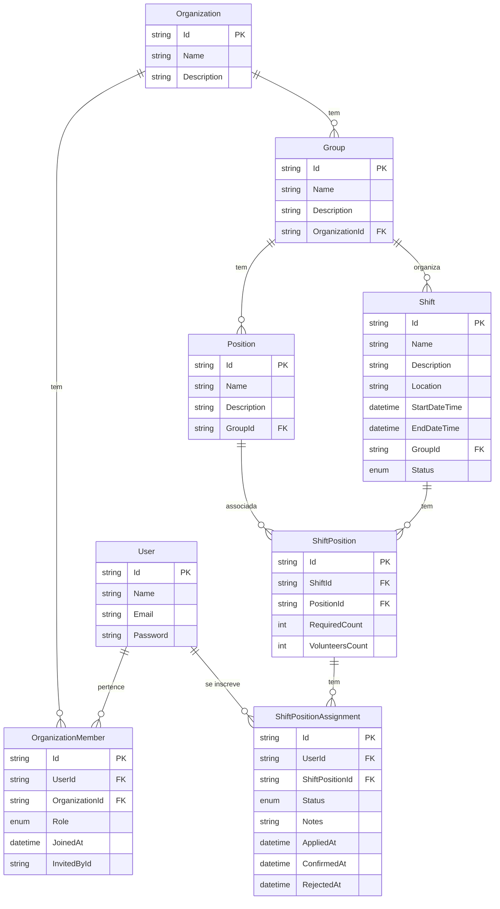

# Volts Backend - .NET Core Web API


## Integrantes

- Adriano Barros
- Brendon Gomes
- Elias Barbosa
- Rafael Gonçalves

## Descrição do Projeto

O Volts é um sistema de gerenciamento de voluntários para eventos e organizações. Ele permite que organizações criem grupos, escalas e posições, e que voluntários se inscrevam para trabalhar nessas posições.

O sistema é utilizado por:

- **Administradores de Organizações**: Criam e gerenciam organizações, grupos e escalas
- **Líderes de Grupos**: Gerenciam grupos específicos e seus membros
- **Voluntários**: Visualizam e se inscrevem em posições disponíveis nas escalas

As principais entidades do sistema se relacionam da seguinte forma:

- **Organizações (Organizations)**: Entidade principal que representa uma instituição ou evento
- **Grupos (Groups)**: Subdivisões dentro de uma organização, como departamentos ou equipes
- **Escalas (Shifts)**: Períodos de trabalho com data, hora e local definidos
- **Posições (Positions)**: Funções específicas que podem ser ocupadas por voluntários
- **Inscrições (ShiftPositionAssignments)**: Registros de voluntários inscritos para trabalhar em posições específicas

## 🧰 Tecnologias Utilizadas

- **Linguagem principal:** C#
- **Framework:** .NET Core 8
- **Banco de dados:** PostgreSQL (com suporte futuro via Supabase)
- **ORM:** Entity Framework Core
- **Autenticação:** JWT (JSON Web Token)
- **Padrões de arquitetura:** Repository Pattern, Unit of Work, DTOs e Services
- **Outras:** Swagger

## 🐳 Docker e Deploy

O projeto utiliza Docker para facilitar o desenvolvimento local e o deploy em produção. Existem duas abordagens principais configuradas no repositório:

### 1️⃣ Docker Compose (Ambiente de Desenvolvimento Local)

O arquivo `docker-compose.yml` foi configurado para **facilitar testes locais**, permitindo subir a aplicação completa sem a necessidade de instalar dependências (como o banco de dados) diretamente na máquina.

- **Cenário de Uso**
  - Testes locais e desenvolvimento.
  - Quando você precisa da API rodando junto com uma instância limpa do PostgreSQL.

- **Estrutura:**
  - **Serviço `api`**: Constrói a imagem da aplicação a partir do `Dockerfile` e a executa na porta `8080`.
  - **Serviço `db`**: Sobe um container PostgreSQL (versão 16) pré-configurado com usuário e banco de dados de teste (`volts-test`).
  - **Rede**: Ambos os serviços compartilham a rede `volts-net` para comunicação interna.

#### Como executar

```bash
docker-compose up --build
```

### 2️⃣ Dockerfile (Deploy no Render)

O `Dockerfile` na raiz do projeto é utilizado principalmente para o **deploy em produção**, especificamente na plataforma **Render** (como Web Service).

- **Cenário de Uso**
  - Hospedagem da aplicação em ambiente de produção (Cloud).
  - Criação da imagem final otimizada para execução.

- **Estrutura**
  - **Build Stage**: Utiliza a imagem `dotnet/sdk:8.0` para restaurar dependências e compilar o projeto (`dotnet publish`).
  - **Runtime Stage**: Utiliza a imagem `dotnet/aspnet:8.0` (mais leve) apenas para executar a aplicação.
  - **Configuração**: Define a variável de ambiente `ASPNETCORE_ENVIRONMENT=Production` e expõe a porta `8080` (configurável via variável `PORT`, padrão do Render).

**Fluxo no Render:**
O Render detecta o `Dockerfile`, constrói a imagem e inicia o container executando o comando definido no `CMD`.

## Modelo de Domínio do Volts

O diagrama abaixo representa as principais entidades do sistema Volts e seus relacionamentos.

O código do diagrama pode ser visto por aqui: [Acessar diagrama feito com Mermaid](./mermaid.md)



## Descrição das Entidades do Domínio

### User

Representa uma pessoa cadastrada no sistema. Contém informações básicas como nome, email e credenciais de acesso.  
Usuários podem participar de organizações, grupos e escalas como voluntários.

### Organization

Representa uma instituição, igreja, ONG, empresa ou equipe que utiliza o sistema.  
Cada organização possui seus próprios **grupos**, **membros**, **posições** e **escalas**.

### OrganizationMember

Representa a participação de um usuário dentro de uma organização.  
Define **o nível de permissão (role)** do usuário na organização:  

- *Member*  
- *Leader*  
- *Admin*  

Todas as permissões do sistema são determinadas por esta entidade.

### Group

Representa uma subdivisão dentro da organização, como um ministério, área, departamento ou equipe.  
Cada grupo possui suas próprias **posições**, **escalas** e **tarefas**.

### Position

Representa um cargo ou papel desempenhado pelos membros dentro de um grupo, como “Recepcionista”, “Músico”, “Auxiliar”, etc.  
As posições são usadas para compor escalas.

### Shift

Representa uma escala/evento em um dia e horário específico, como um culto, reunião ou atividade.  
Cada shift pertence a um grupo e possui diversas posições necessárias.

### ShiftPosition

Representa a necessidade de uma posição específica dentro de uma escala, determinando quantos voluntários são necessários e quantos já estão inscritos.

### ShiftPositionAssignment

Representa a inscrição de um usuário para preencher uma posição específica dentro de uma escala.  
Mantém o status da inscrição (pendente, confirmado, rejeitado) e eventuais observações.

## Descrição dos Relacionamentos

1. **User - OrganizationMember**  
   Um usuário pode participar de várias organizações, e uma organização pode possuir vários membros.  
   A role (permissão) do usuário é controlada exclusivamente em **nível de organização**, via `OrganizationMember.Role`.
2. **Organization - OrganizationMember**  
   Uma organização pode ter vários membros cadastrados, cada um com seu próprio nível de permissão  
   (`Member`, `Leader`, `Admin`).
3. **Organization - Group**  
   Uma organização pode ter vários grupos.  
   Cada grupo pertence exclusivamente a uma única organização.
4. **Group - Position**  
   Cada grupo pode definir várias posições internas.  
   Uma posição sempre pertence a um único grupo.
5. **Group - Shift**  
   Um grupo pode organizar várias escalas (shifts).  
   Cada escala pertence a exatamente um grupo.
6. **Shift - ShiftPosition**  
   Uma escala (shift) pode ter várias posições necessárias para aquele evento.  
   Cada `ShiftPosition` representa a quantidade necessária e os voluntários inscritos para uma posição dentro de um shift.
7. **Position - ShiftPosition**  
   Uma única posição pode ser usada em várias escalas diferentes.  
   Cada `ShiftPosition` referencia qual `Position` ela representa dentro de um shift.
8. **ShiftPosition - ShiftPositionAssignment**  
   Cada posição de escala (`ShiftPosition`) pode receber várias inscrições de voluntários.  
   Cada inscrição (`ShiftPositionAssignment`) representa o interesse ou confirmação de um usuário atuar naquela posição específica.
9. **User - ShiftPositionAssignment**  
   Um usuário pode se inscrever em diversas posições de diversas escalas.  
   Cada inscrição está sempre vinculada a um único usuário.

## Estrutura do Projeto

O projeto segue uma arquitetura em camadas:

- **Controllers (Volts.Api)**: Responsáveis por receber as requisições HTTP e retornar as respostas
- **Services (Volts.Application)**: Implementam a lógica de negócio e orquestram as operações
- **Repositories (Volts.Infrastructure)**: Responsáveis pelo acesso aos dados
- **Entities (Volts.Domain)**: Definem o modelo de domínio e as regras de negócio
- **DTOs (Volts.Application)**: Objetos de transferência de dados entre as camadas

## Modelo de Dados (ER) - Atual

Relações principais (com RBAC por organização):

- `Organization` - possui muitos `Group`.
- `Group` - possui muitas `Position` e muitas `Shift`.
- `Shift` - possui muitos `ShiftPosition`.
- `ShiftPosition` - possui muitos `ShiftPositionAssignment`.
- `User` - possui muitas `OrganizationMember` (um papel por organização).
- `User` - relaciona com `ShiftPositionAssignment` (se inscreve nas posições).

## 🔐 Controle de Acesso (RBAC)

### Descrição Geral

- O projeto utiliza RBAC (Role-Based Access Control) para controlar o que cada usuário pode fazer dentro da aplicação.
- O controle é dividido entre níveis de organização e níveis de grupo, cada um com papéis e permissões específicos.

### Papéis da Organização (OrganizationRoleEnum)

- **ADMIN**: possui acesso total à organização. Pode gerenciar usuários, grupos e configurações.
- **LEADER**: pode criar e gerenciar grupos dentro da organização.
- **MEMBER**: participa de grupos, mas sem permissões administrativas, apenas se aplica/voluntaria nas escalas dos grupos.

### Regras de Negócio Principais

- **ADMIN** e **LEADER** podem criar grupos dentro da organização.
- Dentro dos grupos, apenas o **ADMIN** e **LEADER** podem criar posições e escalas.
- **VOLUNTEERS** podem visualizar e se inscrever nas posições das escalas.

## Rotas da API

Abaixo os controllers atuais e seus endpoints conforme a implementação do código.

### AuthController (`/api/auth`)

- `POST /api/auth/register` - Registro de usuário.
- `POST /api/auth/login` - Login e emissão de JWT.

### UserController (`/api/user`)

- `GET /api/user/me` - Dados do usuário autenticado.
- `GET /api/user/organizations` - Organizações do usuário (onde possui `OrganizationMember`).

### OrganizationsController (`/api/organizations`)

- Listagem e detalhes:
  - `GET /api/organizations` - Lista todas as organizações.
  - `GET /api/organizations/available` - Organizações disponíveis para o usuário entrar.
  - `GET /api/organizations/{id}` - Detalhes de uma organização.
  - `GET /api/organizations/{id}/completeView` - Visão completa de uma organização (para UI).
  - `GET /api/organizations/completeView` - Lista de visões completas de organizações.
  - `GET /api/organizations/creator/{creatorId}` - Organizações por criador.
  - `GET /api/organizations/me` - Organizações do usuário atual.
- CRUD:
  - `POST /api/organizations` - Cria uma organização (usuário se torna `ADMIN` por padrão).
  - `PUT /api/organizations/{id}` - Atualiza dados da organização (permite `LEADER`/`ADMIN`).
  - `DELETE /api/organizations/{id}` - Remove a organização (permite `ADMIN`).
- Membros:
  - `GET /api/organizations/{organizationId}/members` - Lista membros da organização.
  - `POST /api/organizations/{id}/invite-member` - Convida (adiciona) um usuário por email (permite `LEADER`/`ADMIN`).
  - `PUT /api/organizations/{organizationId}/members/{memberId}/role` - Altera a role de um membro (ver regras de role acima).
  - `DELETE /api/organizations/{organizationId}/members/{memberId}` - Remove um membro da organização (permite `LEADER`/`ADMIN`).
- Participação:
  - `POST /api/organizations/{id}/join` - Usuário entra na organização (auto-join idempotente).
  - `POST /api/organizations/{id}/leave` - Usuário sai da organização.

Observação de rota:

- Há um endpoint de visão de grupos por organização exposto em `GET /api/organizations/{organizationId}/Groups/completeView` (com “Groups” capitalizado) para lista de visões completas de grupos da organização.

### GroupsController (`/api/groups`)

- `GET /api/groups` - Lista grupos.
- `GET /api/groups/{id}` - Detalhes do grupo.
- `GET /api/groups/{id}/completeView` - Visão completa do grupo.
- `POST /api/groups` - Cria grupo (permite `LEADER`/`ADMIN`).
- `PUT /api/groups/{id}` - Atualiza grupo (permite `LEADER`/`ADMIN`).
- `DELETE /api/groups/{id}` - Deleta grupo (permite `LEADER`/`ADMIN`).
- `GET /api/groups/{id}/positions` - Lista posições do grupo.

### PositionsController (`/api/positions`)

- `GET /api/positions/groups/{id}/positions` - Posições por `groupId`.
- `POST /api/positions` - Cria posição (permite `LEADER`/`ADMIN`).
- `GET /api/positions/{id}` - Detalhes da posição.
- `PUT /api/positions/{id}` - Atualiza posição (permite `LEADER`/`ADMIN`).
- `DELETE /api/positions/{id}` - Deleta posição (permite `LEADER`/`ADMIN`).

### ShiftsController (`/api/shifts`)

- `GET /api/shifts/groups/{id}/shifts` - Shifts por `groupId`.
- `POST /api/shifts` - Cria shift (permite `LEADER`/`ADMIN`).
- `GET /api/shifts/{id}` - Detalhes do shift.
- `PUT /api/shifts/{id}` - Atualiza shift (permite `LEADER`/`ADMIN`).
- `DELETE /api/shifts/{id}` - Deleta shift (permite `LEADER`/`ADMIN`).

### ShiftPositionAssignmentController (`/api`)

- `GET /api/shifts/{id}/assignments` - Inscrições por `shiftId` (requer vínculo com a organização).
- `GET /api/shift-positions/{id}/assignments` - Inscrições por `shiftPositionId`.
- `GET /api/assignments/{id}` - Detalhes da inscrição.
- `POST /api/shift-positions/{id}/apply` - Aplica o usuário atual à posição (`MEMBER` aplica apenas para si).
- `PUT /api/assignments/{id}/confirm` - Confirma inscrição (permite `LEADER`/`ADMIN`).
- `PUT /api/assignments/{id}/cancel` - Cancela inscrição (autor da inscrição ou `LEADER`/`ADMIN`).
- `DELETE /api/assignments/{id}` - Deleta inscrição (autor da inscrição ou `LEADER`/`ADMIN`).

## Como Rodar o Projeto

### Pré-requisitos

- .NET 6 SDK ou superior
- Visual Studio 2022, VS Code ou Rider

### Passos para Execução

```bash
# 1. Clone o repositório:
git clone https://github.com/seu-usuario/volts-backend.git

cd volts-backend

# 2. Restaure os pacotes:
dotnet restore

# 3. Execute as migrações do banco de dados:
cd Volts.Api
dotnet ef database update

# 4. Execute o projeto:
dotnet run

# 5. Acesse a documentação da API:
https://localhost:5001/swagger
```

### Configuração do Ambiente

Para configurar variáveis de ambiente ou outras configurações, edite o arquivo `appsettings.json` ou crie um arquivo `appsettings.Development.json` para configurações específicas de desenvolvimento.

## Comandos úteis

- Criar migration do C# Backend

```bash
# Criar migration
dotnet ef migrations add InitialCreate --project Volts.Infrastructure --startup-project Volts.Api

# Atualizar banco
dotnet ef database update --project Volts.Infrastructure --startup-project Volts.Api

# Migration no Production, ou mudar pra Development
dotnet ef database update --project Volts.Infrastructure --startup-project Volts.Api --environment Production

# Migration em um script
dotnet ef migrations script --idempotent --project Volts.Infrastructure --startup-project Volts.Api --output POSTGRE_SQL_SCRIPT_MIGRATION.sql
```
