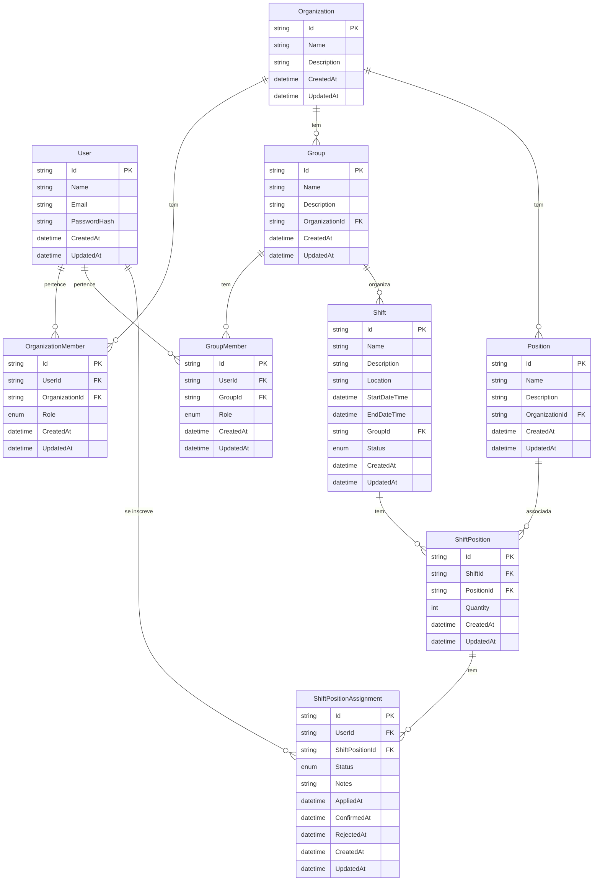

# Modelo de Domínio do Volts

O diagrama abaixo representa as principais entidades do sistema Volts e seus relacionamentos.

## Descrição dos Relacionamentos

1. **User - OrganizationMember**: Um usuário pode pertencer a várias organizações, e uma organização pode ter vários membros.

2. **Organization - Group**: Uma organização pode ter vários grupos, mas um grupo pertence a apenas uma organização.

3. **Organization - Position**: Uma organização pode definir várias posições, e cada posição pertence a uma organização.

4. **User - GroupMember**: Um usuário pode ser membro de vários grupos, e um grupo pode ter vários membros.

5. **Group - Shift**: Um grupo pode organizar várias escalas, e cada escala é organizada por um grupo.

6. **Shift - ShiftPosition**: Uma escala pode ter várias posições, e cada posição de escala está associada a uma escala.

7. **Position - ShiftPosition**: Uma posição pode ser usada em várias escalas, e cada posição de escala está associada a uma posição.

8. **ShiftPosition - ShiftPositionAssignment**: Uma posição de escala pode ter várias inscrições de voluntários, e cada inscrição está associada a uma posição de escala.

9. **User - ShiftPositionAssignment**: Um usuário pode se inscrever em várias posições de escala, e cada inscrição está associada a um usuário.